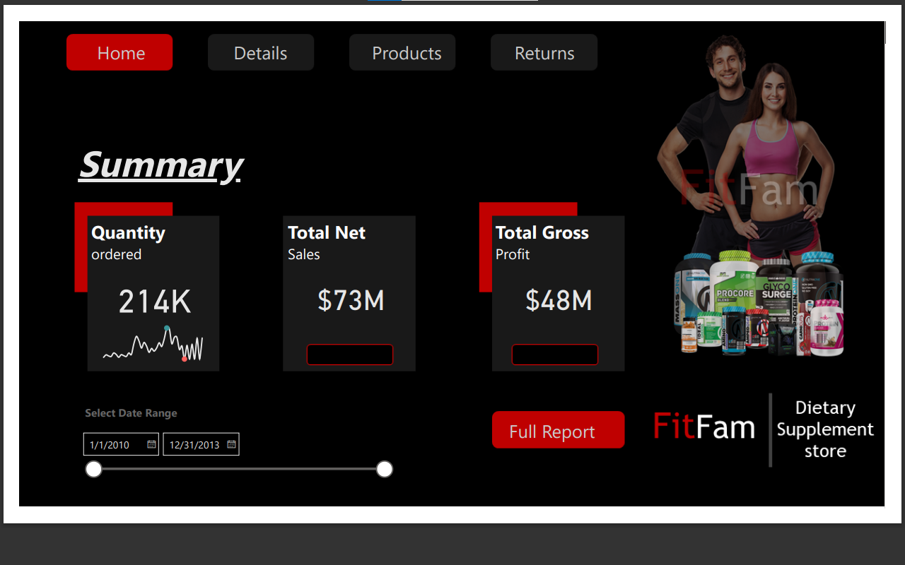
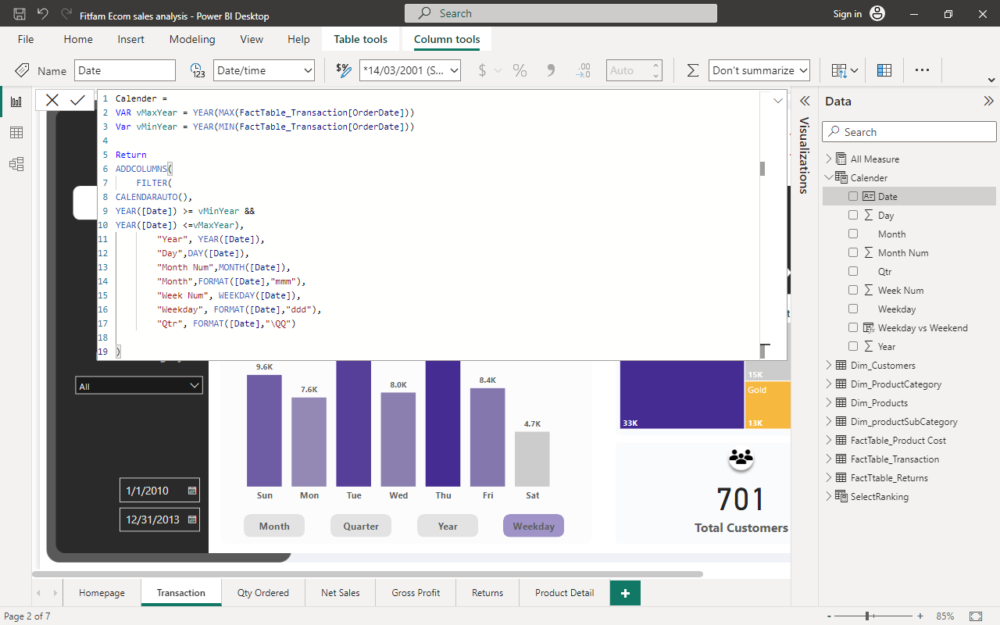
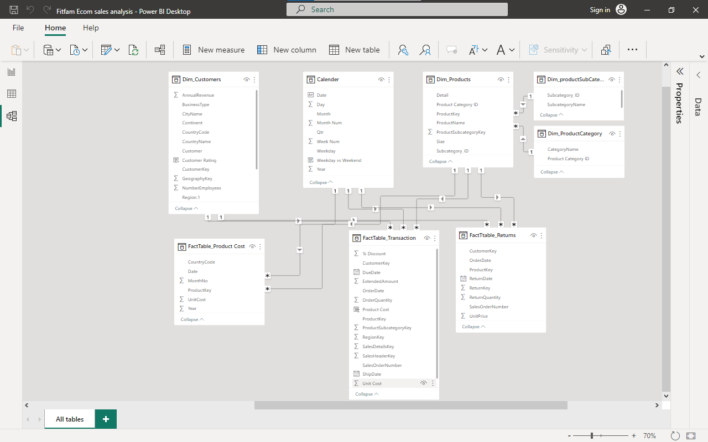
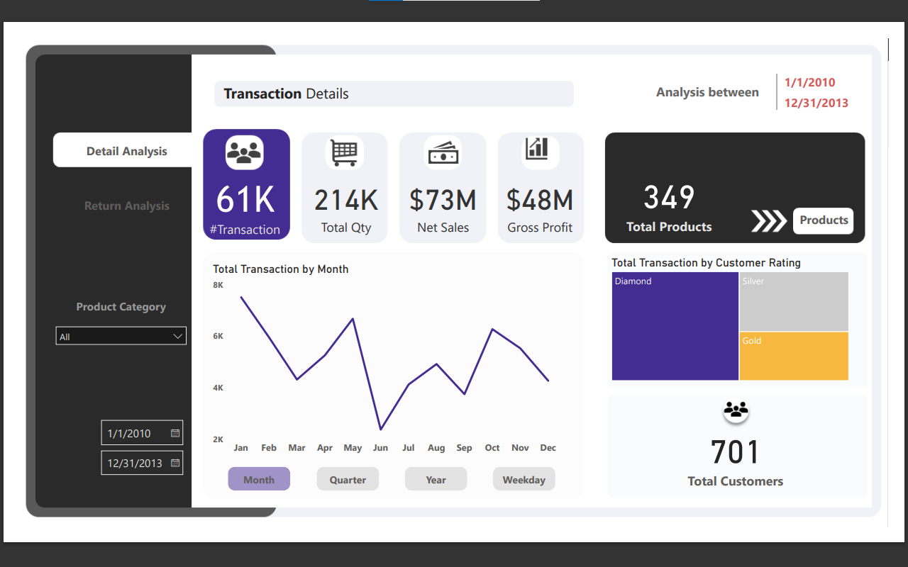
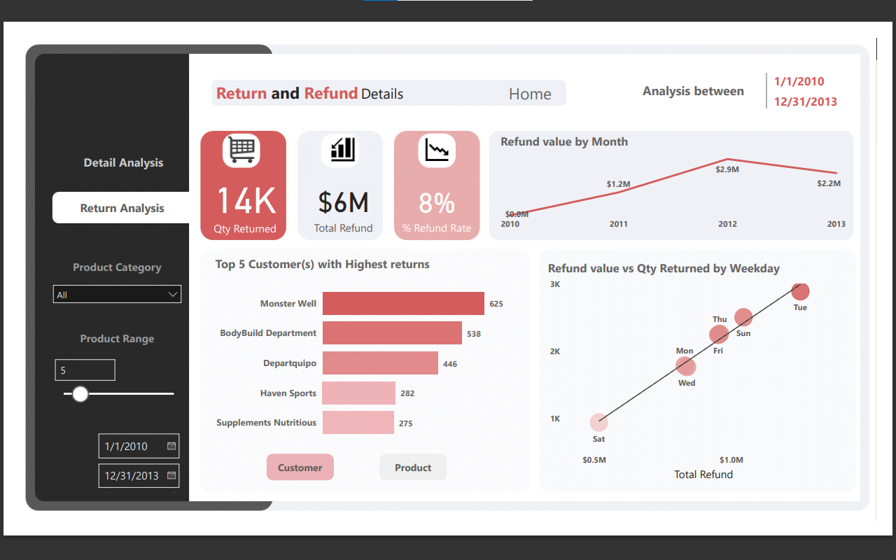
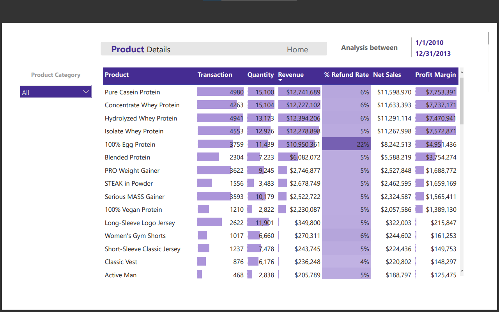

# FitFam Dietary supplement Online store Performance Analysis

## INTRODUCTION

FitFam is a fictitious online retail store that sells Dietary Supplement and fitness items to smaller retailers and end consumers. The sales dataset from 2010-2013 was provided to gain historical insight that would be valuable to the company as management want to gain insights into factors that affected Sales Performance.
With expansion in mind, the company is also seeking guidance into products that are not performing well so they can keep clear focus on whats is working  

### Problem Statement 

As a Data Analyst, I was tasked to analyze their historical data and design an detailed business solution for the company
I was tasked to track KPIs like ( Net sale, profit, Orders and returns) and show the products with the highest return and refund rate. 
Also to show these KPIs on weekly, monthly, quarterly and yearly basis

### Skills and Concept demonstrated

Data cleaning, powerQuery Functions, Data Transformation, Data Modeling Data analysis & visualization 

### Data Cleansing and Transformation

The Dataset was loaded to power-query and the following activities took place
- The tables were properly named to ensure easy identification.
- The Dim-products table was normalized and two other tables were created from the Dim-products table which include the Dim- category and Dim-subcategory this was to reduce redundancy and inconsistent dependency. Primary keys were attributed to these table which became foreign keys in the Dim-product table.
- After all checks have been concluded the data was push into Powerbi visualization pane.
- A Date Table was created to standardize the date range the dates would be selected from. This has to be done to prevent the BI from selected dates from different date tables. This could lead to miscalculation; this was done using DAX.

### Data Modeling

The Data Modelling was done to connect related tables together. Since the tables have been grouped into fact tables and dimension table connecting them together wasn’t much of a hassle. Several measures were created for the Analysis using DAX. There are three facts table and five Dimensional table with the five dimenal tables connecting to the three facts tables abd none of the facts table connecting to other i.e it a star-schema and no many-to-many relationships 

### DATA visualization & Insights

- The BI report consists of 4 interactive pages which include the Homepage, Transaction details page, Refund and Return Analysis Page, Product details page. The Template was created using Powerpoint.
- Each page includes several navigation buttons which navigates you to related pages for further analysis, it also includes in-page Navigation button. Also, the Calendar acts as filter where you can filter to see analysis within a certain period

### INSIGHTS

- An estimated total of 61,000 transaction took place between 2010-2013 and 214,000 Units of products were sold.
- Net sale of $73M was made and a gross Profit of $48M was made during this period
- A total of 14k quantity of product was returned and $6M was refunded to customers, this represents 8% refund rate compared to the total Revenue
 	2012 represented the highest refund year followed by 2013   
- The 100% egg Protein was by far the most returned product, it was returned about 2,500 times, while the customer with the highest return was the Monster-well followed by the Body-Build Department

- The Pure Casein Protein generated the highest revenue of $12.7M during this period followed by Concentrate Whey Protein with also 12.7M
- The Vigor Male Multivitamin generated the least revenue of just $926 followed by the Victus meal replacement with $1,199 and the Animal M-stak with $1,519 

### Recommendations

- The 100% egg Protein should be looked into to determine why it was returned by far the most times even though it was one the most profitable products
- The Vigor male Multivitamin and the Victus Meal replacement should either be improved upon or dropped totally as it does not contribute any significant value to the revenue.

To interact with this Report click the link below
https://app.powerbi.com/reportEmbed?reportId=38ced4af-0079-4622-9ebb-6a1442834234&autoAuth=true&ctid=8c8a8fe7-339a-4647-9a44-591b01a33f09
